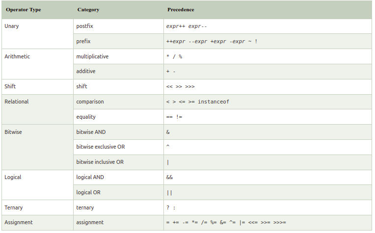

# Operators in Java

Operator in Java is a symbol that is used to perform operations. For example: +, -, *, / etc.
There are many types of operators in Java which are given below:

1. Unary Operator,
2. Arithmetic Operator,
3. Shift Operator,
4. Relational Operator,
5. Bitwise Operator,
6. Logical Operator,
7. Ternary Operator and
8. Assignment Operator.

**Java Operator Precedence**

**Java Unary Operator**

The Java unary operators require only one operand. Unary operators are used to perform various operations i.e.:

1. incrementing/decrementing a value by one
2. negating an expression
3. inverting the value of a boolean

**Java Arithmetic Operators**

Java arithmetic operators are used to perform addition, subtraction, multiplication, and division. They act as basic mathematical operations.

**Java Left Shift Operator**
The Java left shift operator << is used to shift all of the bits in a value to the left side of a specified number of times.

**Java Right Shift Operator**
The Java right shift operator >> is used to move the value of the left operand to right by the number of bits specified by the right operand.

**Java AND Operator Logical && and Bitwise &**
The logical && operator doesn't check the second condition if the first condition is false. It checks the second condition only if the first one is true.
The bitwise & operator always checks both conditions whether first condition is true or false.

**Java OR Operator : Logical || and Bitwise |**
The logical || operator doesn't check the second condition if the first condition is true. It checks the second condition only if the first one is false.
The bitwise | operator always checks both conditions whether first condition is true or false.

**Java Ternary Operator**
Java Ternary operator is used as one line replacement for if-then-else statement and used a lot in Java programming. It is the only conditional operator which takes three operands.

**Java Assignment Operator**
Java assignment operator is one of the most common operators. It is used to assign the value on its right to the operand on its left.